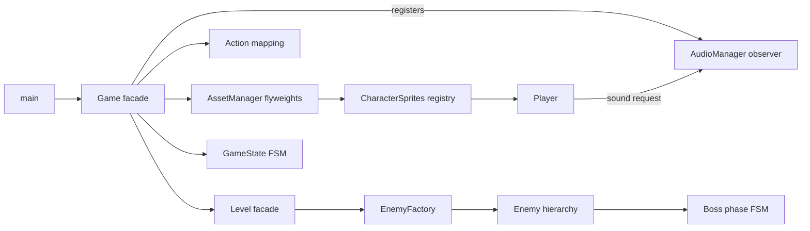

# Design Pattern Evidence

This document identifies the design patterns that are implemented in the project and points to their concrete participants. The first five entries are the primary patterns to present for grading. Registry and action mapping are additional supporting patterns.

## Summary

| # | Pattern | Category | Main participants | Status |
|---:|---|---|---|---|
| 1 | Simple Factory | Creational | `EnemyFactory`, `Level` | Explicit implementation |
| 2 | Observer | Behavioral | `SoundObserver`, `Player`, `AudioManager`, `Game` | Explicit implementation |
| 3 | State / FSM | Behavioral | `GameState`, `Game`, `BossEnemy::Phase` | Existing implementation |
| 4 | Facade | Structural | `Game`, `Level` | Existing implementation |
| 5 | Flyweight | Structural | `AssetManager`, SFML resources, entities and UI | Existing implementation |
| 6 | Registry | Architectural | `CharacterSprites`, `CharacterSpriteSet` | Additional pattern |
| 7 | Command / Action Mapping | Behavioral style | `InputManager::Action`, key-binding tables | Additional pattern |

## 1. Simple Factory

The Simple Factory centralizes enemy construction instead of making `Level` know every concrete constructor.

- Factory: `include/Entities/EnemyFactory.h`, `src/Entities/EnemyFactory.cpp`
- Products: `PatrolEnemy`, `ShooterEnemy`, `FlyingEnemy`, and `BossEnemy`
- Common product interface: `Enemy`
- Client: `Level::spawnFromMap()` in `src/World/Level.cpp`

`EnemyFactory::create()` converts the map symbols `P`, `R`, `F`, and `B` into `std::unique_ptr<Enemy>`. An unknown symbol returns `nullptr`. `Level` applies the difficulty health bonus through the common `Enemy` interface and then takes ownership of the result.

Benefit: adding another map-spawnable enemy changes the factory rather than adding constructor-selection logic to the world coordinator.

## 2. Observer

Gameplay code publishes sound requests without depending directly on SFML audio or `AudioManager`.

- Observer interface: `SoundObserver`
- Concrete observer: `AudioManager`
- Subject/publisher: `Player`
- Composition root: `Game`

`Game` registers its `AudioManager` with `Player::setSoundObserver()`. `Player` publishes logical sound identifiers such as `jump`, `pick_up`, or an attack sound. `AudioManager::onSoundRequested()` receives those notifications and plays the cached buffer. The observer is non-owning and is disconnected in `Game::~Game()`.

Benefit: `Player` remains independent from the audio implementation. The existing callback setter remains as a compatibility fallback, so older code is not broken.

## 3. State / Finite State Machine

The code selects behavior from explicit states instead of scattering unrelated Boolean combinations.

### Application FSM

- State identifier: `GameState` in `include/Core/GameState.h`
- Context: `Game`
- States: Menu, Info, LevelSelect, DifficultySelect, Shop, CharacterSelect, Controls, Playing, Paused, GameOver, and Victory
- Behavior selection: `Game::update()` and `Game::render()`

### Boss FSM

- State identifier: `BossEnemy::Phase`
- Context: `BossEnemy`
- States: PhaseOne and Enraged
- Transition: `BossEnemy::updatePhase()` at the configured health ratio
- State-specific behavior: `movementSpeed()`, `attackCooldown()`, and `fireAttack()`

Benefit: transitions and state-dependent behavior are named and localized. The implementation is an enum-driven FSM, which is appropriate here because the state sets are small and fixed.

## 4. Facade

Two high-level classes provide simple entry points over groups of collaborating subsystems.

- Application facade: `Game`
  - Coordinates the window, assets, audio, input, menus, camera, persistence, and the active level.
  - Exposes one public runtime operation: `run()`.
- Gameplay facade: `Level`
  - Owns actors and world objects.
  - Coordinates actor updates, combat, pickups, hazards, checkpoints, achievements, cleanup, and drawing.
  - Provides focused operations such as `update()`, `draw()`, `dropLoot()`, and `tryPlaceBlock()`.

Benefit: `main()` only creates `Game` and calls `run()`, while individual actors interact with the level through a stable high-level API rather than coordinating every subsystem themselves.

## 5. Flyweight

Large immutable SFML resources are loaded once and shared by reference instead of copied into every entity.

- Flyweight factory/cache: `AssetManager`
- Shared intrinsic state: `sf::Texture` and `sf::Font` instances stored by identifier
- Clients: players, enemies, projectiles, dropped items, HUD, menu, and level rendering
- Extrinsic state: entity position, animation frame, facing direction, color, and scale

`AssetManager::texture()` and `font()` return const references to cached resources. Sprite metadata stores non-owning texture pointers, while each entity supplies its own transform and animation state when drawing.

Benefit: expensive texture/font data exists once per asset key, reducing memory use and keeping resource lifetime under `Game` ownership.

## 6. Registry (additional)

`CharacterSprites` stores `CharacterSpriteSet` objects in an `unordered_map` keyed by `spriteId`.

- Registration: `CharacterSprites::registerSet()`
- Lookup: `CharacterSprites::get()`
- Storage: `CharacterSprites::registry()`
- Client: `Player`, using the selected profile's `spriteId`

Benefit: character profiles select sprite behavior by data rather than by hard-coded texture branches inside `Player`.

## 7. Command / Action Mapping (additional)

`InputManager::Action` names logical commands such as MoveLeft, Jump, Attack, and UseItem independently from physical keys. Player-specific binding tables translate those commands into an `InputState`, and the controls screen can rebind them at runtime.

Benefit: gameplay code consumes semantic actions rather than checking concrete keyboard keys. The current implementation uses fixed-size player binding tables; the declared `ActionBindings` alias documents the equivalent `unordered_map<Action, Key>` representation.

## Interaction overview

## Refactoring performed for pattern clarity

The following changes formalize existing behavior without changing game rules:

1. Moved the `P/R/F/B` enemy-construction branch from `Level::spawnFromMap()` into `EnemyFactory::create()`.
2. Added the `SoundObserver` interface and made `AudioManager` its concrete observer.
3. Replaced `Game`'s audio lambda registration with `Player::setSoundObserver(&audio)` while preserving the legacy callback API as a fallback.
4. Added concise English documentation to every declared function. Source-only helper functions are documented at their definitions.

