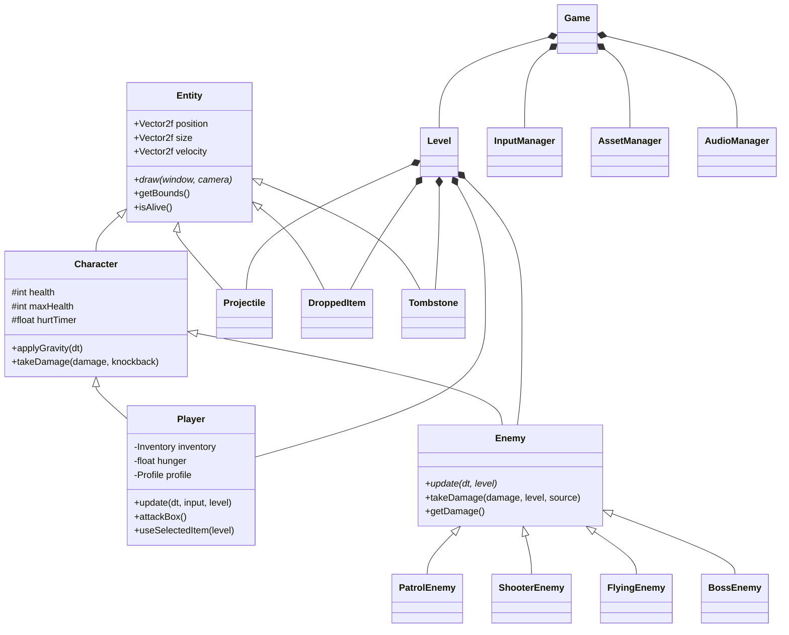
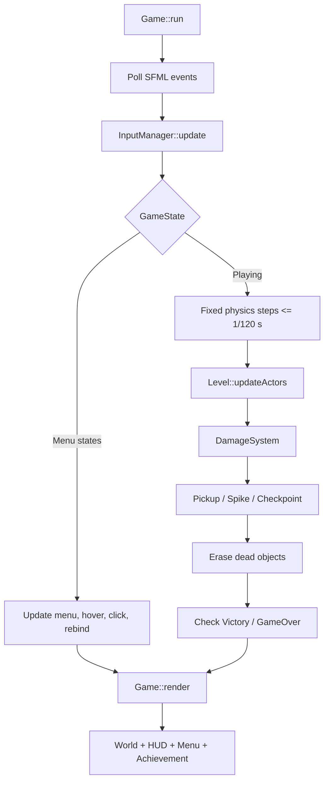

# 2D Co-op Combat Platformer - Project Report

**Môn học:** CS202 - Lập trình hướng đối tượng (Object-Oriented Programming)
**Nhóm thực hiện:** Duo Track - 2 thành viên
**Công nghệ:** C++17, SFML 3, CMake, Git/GitHub
**Phiên bản được khảo sát:** nhánh `main`, commit `6f7ac6b` (`report demo, need to be checked`)
**Ngày cập nhật báo cáo:** 02/09/2026
**Baseline đối chiếu:** `CS202-FinalProject_SuperMario (1).docx` - yêu cầu đồ án nhóm thông thường

---

## 1. Tổng quan dự án (Project Overview)

### 1.1. Giới thiệu đề tài

`2D Co-op Combat Platformer` là game đi cảnh - chiến đấu 2D dành cho một hoặc hai người chơi trên cùng máy. Trò chơi lấy cảm hứng từ cách di chuyển và không khí rừng huyền ảo của *Ori*, kết hợp cấu trúc vượt chướng ngại kiểu platformer, chiến đấu cận chiến, quản lý tài nguyên và phối hợp đồng đội.

Người chơi phải di chuyển qua các bản đồ dạng tile, tránh gai, đánh bại nhiều loại quái, thu thập vật phẩm, sử dụng block để tạo đường đi và đến cổng đích. Ở chế độ hai người, camera dùng chung và giới hạn khoảng cách giúp hai nhân vật luôn hoạt động trong cùng khu vực.

### 1.2. Mục tiêu kỹ thuật

Dự án tập trung vào các mục tiêu sau:

- Xây dựng game loop thời gian thực bằng C++ và SFML.
- Hỗ trợ local co-op cho tối đa hai người chơi với bộ phím độc lập.
- Vận dụng kế thừa, đa hình, trừu tượng và đóng gói trong hệ thống entity.
- Quản lý vòng đời object bằng RAII và `std::unique_ptr`, không dùng `new`/`delete` thủ công trong gameplay.
- Tách hệ thống thành các module Core, World, Entities, Combat, Graphics và UI.
- Nạp level từ file văn bản và nạp texture/audio tập trung.
- Xây dựng combat, inventory, hunger, tombstone, checkpoint, block placement, nhiều loại enemy và boss nhiều phase.
- Hỗ trợ menu bằng chuột, hiệu ứng hover, cuộn danh sách và key rebinding.

### 1.3. Công nghệ và công cụ

| Thành phần | Công nghệ thực tế |
| --- | --- |
| Ngôn ngữ | C++17 |
| Graphics / Window / Input | SFML 3 Graphics, Window, System |
| Âm thanh | SFML 3 Audio (`sf::SoundBuffer`, `sf::Sound`, `sf::Music`) |
| Build system | CMake 3.28 trở lên |
| Quản lý phiên bản | Git, GitHub, branch `A`, `B`, `main` |
| Dữ liệu level | Text map trong `assets/levels/*.txt` |
| Đồ họa | Texture và spritesheet pixel-art trong `assets/textures/` |
| Âm thanh | WAV/MP3 cho SFX, OGG cho nhạc nền |

### 1.4. Cấu trúc repository thực tế

```text
CS202-FinalProject_SuperMario_Rubric/
|-- CMakeLists.txt
|-- README.md
|-- include/
|   |-- Core/       # Game, state, input, asset, audio, camera
|   |-- World/      # Level, loader, tile map, collision, checkpoint...
|   |-- Entities/   # Player, enemy, projectile, item, tombstone, fairy
|   |-- Combat/     # DamageSystem, Hitbox, LootTable
|   |-- Graphics/   # Animation, Animator, sprite registries
|   |-- UI/         # HUD, MenuScreen
|   `-- Utils/      # Constants, MathUtils
|-- src/            # Implementation tương ứng với các module trên
`-- assets/
    |-- audio/
    |-- fonts/
    |-- levels/     # level1, level2, level3, boss
    `-- textures/   # player, slime, mushroom, bat, golem, UI...
```

### 1.5. Cách build và chạy

SFML 3 phải được cài đặt và có thể được tìm thấy bởi CMake.

```bash
cmake -S . -B build
cmake --build build --config Debug
```

Sau khi build, CMake tự động sao chép thư mục `assets/` đến cạnh executable. Trên cấu hình đang dùng, file chạy là `build/sfml_CS202.exe`.

---

## 2. Thiết kế gameplay và cơ chế thực tế (Game Mechanics)

### 2.1. Luồng chơi tổng quát

1. Người chơi chọn chế độ một hoặc hai người.
2. Chọn một trong bốn level và một trong ba độ khó.
3. Chọn profile nhân vật cho từng người chơi.
4. Di chuyển, chiến đấu, nhặt vật phẩm, quản lý hunger và sử dụng block để vượt map.
5. Kích hoạt checkpoint để thay đổi vị trí respawn.
6. Đưa các player đang hoạt động đến cổng đích để chuyển sang trạng thái `Victory`.

Game có các trạng thái thực tế sau:

```text
Menu -> Info / LevelSelect / DifficultySelect / Shop
LevelSelect -> CharacterSelect -> Playing
Playing <-> Paused -> Controls
Playing -> Victory
Playing -> GameOver (đã có state và màn hình, nhưng điều kiện hiện chưa kích hoạt)
```

### 2.2. Input hai người chơi

`InputManager` chuyển phím vật lý thành 16 action logic. Gameplay chỉ đọc `InputState`, do đó code của `Player` không phụ thuộc trực tiếp vào một phím cụ thể.

| Hành động | Player 1 mặc định | Player 2 mặc định |
| --- | --- | --- |
| Di chuyển trái/phải | `A` / `D` | `Left` / `Right` |
| Nhảy | `W` | `Up` |
| Tấn công | `F` | `J` |
| Né đòn | `S` | `Down` |
| Dùng vật phẩm | `H` | `L` |
| Ô trước / ô sau | `Q` / `E` | `U` / `I` |
| Pause | `P` | `K` |
| Info | `I` | `O` |
| Chọn nhanh inventory | `1` đến `6` | Chưa hỗ trợ chọn nhanh |

Màn Controls cho phép:

- Click tab Player 1 hoặc Player 2.
- Click một action để vào trạng thái chờ nhập phím.
- Nhấn phím mới để rebind.
- Từ chối phím đã được sử dụng nhằm tránh binding trùng.
- Nhấn `Escape` để hủy thao tác.

Menu sử dụng `sf::Event::MouseButtonPressed` cho click trái. Tọa độ pixel được chuyển sang tọa độ UI bằng `window.mapPixelToCoords(...)`. Hover chỉ thay đổi hình ảnh selector; hành động chỉ được thực thi khi có click. Các danh sách dài hỗ trợ mouse wheel và viewport offset.

### 2.3. Di chuyển và vật lý Player

Mỗi `Player` có AABB kích thước `39 x 63`, velocity, hướng nhìn và trạng thái tiếp đất. Chuyển động ngang sử dụng gia tốc/giảm tốc khác nhau giữa mặt đất và trên không. Các hằng số quan trọng gồm:

- Tốc độ cơ bản: `245 px/s`.
- Vận tốc nhảy: `-610 px/s`.
- Gravity: `1600 px/s²`.
- Coyote time: `0.09 s`.
- Thời gian né: `0.45 s`; cooldown né: `2.0 s`.
- Giới hạn vận tốc rơi: `980 px/s`.

Game chia mỗi frame thành các physics step tối đa `1/120 s`. Collision được giải quyết riêng theo trục X và Y trong `Collision::resolveTileCollision`, giúp giảm xuyên tile và xác định `onGround` ổn định hơn.

Né đòn hiện hoạt động như một khoảng invulnerability kèm hiệu ứng sprite mờ; nó chưa tạo một cú lướt thay đổi vận tốc như dash truyền thống.

### 2.4. Health, hunger và profile nhân vật

Health mặc định của player là 10. Hunger bắt đầu ở 100 và giảm liên tục:

```text
hunger -= 0.45 * dt
```

Với tốc độ này, thanh hunger mất khoảng 222 giây để giảm từ 100 về 0. Khi hunger bằng 0, hệ thống tích lũy starvation damage ở tốc độ 1 HP mỗi giây. Ăn food phục hồi 20 hunger, hồi 1 HP và khóa action trong 0.45 giây.

Hệ thống có sáu profile dữ liệu:

| Profile | Đặc điểm |
| --- | --- |
| Ori | Nhảy cao hơn |
| Rush | Chạy nhanh hơn |
| Guard | Chặn lần nhận damage đầu tiên |
| Titan | Nhiều máu hơn, di chuyển chậm hơn |
| Feather | Rơi chậm |
| Legend | Kết hợp các ưu điểm, cần mở khóa trong Shop |

Profile được triển khai theo hướng data-driven qua các multiplier thay vì tạo sáu subclass Player riêng biệt. Shop cho phép mở Legend với 80 coin và nâng cấp tối đa hai level cho từng profile với giá 20 coin mỗi lần; mỗi level nâng cấp cộng thêm max health.

### 2.5. Inventory và tương tác vật phẩm

Mỗi player có inventory sáu ô độc lập:

| Ô | Nội dung | Cách sử dụng thực tế |
| --- | --- | --- |
| 1-4 | Bốn biến thể food | Ăn để hồi hunger và 1 HP |
| 5 | Coin | Ném một coin ra trước mặt thành `DroppedItem` |
| 6 | Block | Đặt block vào tile grid |

Mỗi inventory bắt đầu với hai block. Player có thể chuyển ô bằng action Prev/Next; Player 1 còn có thể chọn nhanh bằng phím số 1-6.

Khi nhặt `DroppedItem`:

- Food được đưa vào đúng biến thể food.
- Coin được cộng vào ô coin.
- Block được cộng vào ô block.
- Heart hồi trực tiếp `quantity * 2` HP.

### 2.6. Đặt và thu hồi block

`BlockPlacement` tìm tile trống hợp lệ theo hàng ngang trước mặt player. Trước khi đặt, hệ thống kiểm tra tile mới không chồng lên player, enemy, dropped item hoặc tombstone. Nếu thành công, tile được đổi thành solid, trừ một block và ghi lại tọa độ vào danh sách block do player đặt.

Khi chém về phía trước, `Player::tryReclaimPlacedBlock` kiểm tra tile mục tiêu. Chỉ tile có tọa độ nằm trong danh sách block đã được người chơi đặt mới được xóa và hoàn lại một block. Tile tự nhiên của map không có trong danh sách này nên không thể bị phá, tránh làm hỏng địa hình hoặc gây soft-lock.

### 2.7. Combat và DamageSystem

Đòn đánh của player tạo vùng tấn công ngắn trước mặt kích thước `54 x 42`. `DamageSystem` xử lý ba nhóm va chạm:

- Sword hitbox của player với enemy.
- Tiếp xúc trực tiếp giữa enemy và player.
- Projectile với player hoặc enemy.

Player đang né hoặc respawn không nhận contact/projectile damage. Enemy thường nhận knockback theo hướng chém; từng subclass có thể override để tạo phản ứng riêng. Ví dụ `ShooterEnemy` và `BossEnemy` miễn nhiễm knockback, trong khi `PatrolEnemy` và `FlyingEnemy` nhận impulse ngang.

### 2.8. Hệ thống enemy

| Enemy | HP cơ bản | Hành vi thực tế |
| --- | ---: | --- |
| `PatrolEnemy` (Slime) | 2 | Đi ngang ở tốc độ 35, chịu gravity, quay đầu khi va tường, nhận knockback và có hurt/death delay. |
| `ShooterEnemy` (Mushroom) | 3 | Rooted tại spawn, sprite 32x32 scale 2 thành 64x64, quay về player gần nhất và bắn mỗi 1.5 giây. |
| `FlyingEnemy` (Bat) | 2 | Không dùng gravity; bay theo quỹ đạo sin, tuần tra quanh origin, theo player trong phạm vi và đảo hướng khi chạm tường. |
| `BossEnemy` (Golem) | 20 | Di chuyển trên nền, theo dõi player gần nhất, miễn knockback và có FSM hai phase. |

Boss có hai phase:

- **Phase One (`HP > 50%`):** tốc độ 42, cooldown 1.35 giây, bắn ba projectile dạng spread với vận tốc Y `-100`, `0`, `100`.
- **Enraged (`HP <= 50%`):** tốc độ nhân 1.5, cooldown giảm còn 0.70 giây, tạo hai shockwave chạy sát sàn sang trái và phải với tốc độ 520.

Attack của boss được đồng bộ với frame animation: projectile chỉ được sinh khi animation đạt frame quy định. Khi chết, boss tắt damage, chạy death timer và gọi rơi loot ba lần.

### 2.9. Level, checkpoint, camera và điều kiện thắng

Repository có bốn level:

1. Forest Trail
2. Stone Bridge
3. Spike Valley
4. Boss Lair

`LevelLoader` đọc ký tự từ file text:

| Ký tự | Ý nghĩa |
| --- | --- |
| `#` | Solid tile |
| `.` | Không khí |
| `1`, `2` | Spawn Player 1 và Player 2 |
| `P` | PatrolEnemy |
| `R` | ShooterEnemy |
| `F` | FlyingEnemy |
| `B` | BossEnemy |
| `^` | SpikeTrap |
| `C` | Checkpoint |
| `G` | GoalGate |

Camera bám mượt theo trung điểm các player đang hoạt động và clamp trong kích thước map. Hai player bị giới hạn khoảng cách tối đa 1280 pixel.

Khi player chạm checkpoint hoặc goal, spawn point của player đó được cập nhật. Điều kiện thắng hiện tại là:

- Tất cả player đang hoạt động cùng nằm trong vùng goal; hoặc
- Trong chế độ hai người, sau khi có người từng chết và tombstone tương ứng đã được chính chủ thu hồi, một player đang hoạt động đi vào goal.

Player chết chuyển toàn bộ inventory vào tombstone, respawn sau hai giây tại spawn/checkpoint với đầy máu và 50 hunger. Implementation hiện tại chỉ cho player có cùng `ownerId` nhặt tombstone của mình.

### 2.10. UI, audio, save và hiệu ứng phụ trợ

HUD hiển thị health, hunger, inventory, ô đang chọn và trạng thái respawn của từng player. Menu bao gồm chọn số người, level, difficulty, character, shop, info, pause, controls, victory và game-over.

`AudioManager` cache sound buffer và giữ một `std::list` các `sf::Sound` đang phát, nhờ đó nhiều SFX có thể phát đồng thời. Nhạc nền dùng `sf::Music` streaming và loop trong trạng thái Playing. Các sự kiện đã có âm thanh gồm attack riêng theo nhân vật, jump, click, ăn, đặt block, ném đồ, nhặt đồ, victory và game over. File thiếu chỉ tạo warning thay vì làm crash game.

Game tự động lưu vào `data.txt` khi đóng. Dữ liệu lưu gồm wallet coin, số level đã mở, trạng thái Legend, level nâng cấp profile và achievement. Hệ thống achievement có bốn mục: First Kill, 5 Kills, No Damage Run và Boss Defeated. Khi achievement mới mở, fairy tạo hiệu ứng fireworks; mỗi player còn có ba fairy bay orbit hoặc tạo trail khi di chuyển nhanh.

---

## 3. Kiến trúc hệ thống và vận dụng OOP (System Architecture)

### 3.1. Phân chia module

| Module | Trách nhiệm |
| --- | --- |
| `Core` | Game loop, state transition, input, asset, audio, camera, save/load |
| `World` | Level orchestration, text-map loader, tile map, collision, block placement, checkpoint, spike, goal |
| `Entities` | Player, enemy hierarchy, projectile, inventory, dropped item, tombstone, fairy |
| `Combat` | Kiểm tra damage, attack hitbox và định nghĩa loot table |
| `Graphics` | Animation metadata, animator và registry sprite |
| `UI` | HUD và toàn bộ menu/hover/hitbox UI |
| `Utils` | Gameplay constants và hàm toán học dùng chung |

### 3.2. Sơ đồ lớp chính



### 3.3. Bốn tính chất OOP

#### Trừu tượng (Abstraction)

`Entity` định nghĩa dữ liệu transform/lifetime chung và hàm thuần ảo `draw`. `Enemy` bổ sung interface thuần ảo `update(float, Level&)`. Gameplay có thể làm việc với interface `Enemy` mà không cần biết object là slime, mushroom, bat hay boss.

#### Kế thừa (Inheritance)

Cây kế thừa chính là:

```text
Entity
|-- Character
|   |-- Player
|   `-- Enemy
|       |-- PatrolEnemy
|       |-- ShooterEnemy
|       |-- FlyingEnemy
|       `-- BossEnemy
|-- Projectile
|-- DroppedItem
`-- Tombstone
```

`Character` tái sử dụng health, gravity và damage; `Enemy` tái sử dụng health bar, flash timer, loot trigger và damage tiếp xúc.

#### Đa hình (Polymorphism)

`Level` sở hữu `std::vector<std::unique_ptr<Enemy>>`. Trong mỗi frame, lời gọi `enemy->update`, `enemy->draw`, `enemy->takeDamage` và `enemy->getDamage` được dispatch đến override đúng của subclass. Vì `Entity` có virtual destructor nên việc hủy object qua base pointer an toàn.

#### Đóng gói (Encapsulation)

Health, max health, timer, inventory, hunger, FSM và dữ liệu save được đặt ở `protected`/`private` và truy cập qua method. `Constants.h` tập trung các giá trị cân bằng để tránh rải magic number giữa nhiều module.

Mức đóng gói chưa tuyệt đối: `Entity::position`, `size`, `velocity`, `onGround` và `facingDirection` hiện là public để hệ thống collision/AI thao tác trực tiếp. Đây là trade-off giúp tích hợp nhanh, nhưng có thể cải thiện bằng accessor hoặc component vật lý trong phiên bản sau.

### 3.4. Mẫu thiết kế và kỹ thuật kiến trúc

Đối chiếu với yêu cầu “ít nhất 5 design patterns” trong đề bài chuẩn, project có thể xác định sáu pattern/kỹ thuật kiến trúc có vai trò pattern rõ ràng:

- **1. State / Finite State Machine:** `GameState` điều khiển luồng Menu/Playing/Paused/Victory; `BossEnemy::Phase` điều khiển Phase One/Enraged.
- **2. Simple Factory:** `Level::spawnFromMap` nhận ký hiệu `P/R/F/B` và tập trung việc tạo đúng subclass enemy bằng `std::make_unique`, thay vì để client gameplay tự chọn constructor.
- **3. Command / Action Mapping:** `InputManager::Action` tách action gameplay khỏi phím vật lý. Implementation hiện dùng hai mảng binding 16 phần tử; alias `ActionBindings` bằng `unordered_map` đã được khai báo nhưng chưa được sử dụng làm storage chính.
- **4. Registry:** `CharacterSprites` dùng `unordered_map<string, CharacterSpriteSet>` để đăng ký và tra sprite set theo `spriteId`.
- **5. Facade / Manager:** `Game` cung cấp điểm điều phối cấp ứng dụng; `Level` che giấu trình tự update actor, damage, pickup, hazard và cleanup; `AudioManager`/`AssetManager` cung cấp API tài nguyên tập trung.
- **6. Observer-like Callback:** Player phát SFX thông qua `SoundCallback`, tránh phụ thuộc trực tiếp vào `AudioManager`. Đây là callback một subscriber, nhẹ hơn một Observer tổng quát nhưng vẫn thực hiện mục tiêu đảo chiều dependency.
- **RAII:** Texture, font, buffer, music và container đều có owner rõ ràng; entity động dùng `unique_ptr` và được xóa bằng erase-remove.

`AssetManager` và `AudioManager` không phải Singleton. Chúng là object thành viên của `Game`, giúp lifetime rõ ràng và thuận lợi hơn cho test hoặc thay thế implementation.

`LootTable` có API random 50/25/15/10, nhưng luồng runtime hiện tại đang random trực tiếp trong `Level::dropLoot`; vì vậy không nên mô tả `LootTable` như factory đang điều khiển loot ở phiên bản hiện tại.

### 3.5. Luồng update/render



---

## 4. Kế hoạch dự án so với thực tế (Plan vs. Actual Implementation)

### 4.1. Baseline của đồ án nhóm thông thường

File yêu cầu chính thức `CS202-FinalProject_SuperMario (1).docx` mô tả một game Mario-style 2D bằng C++ với các nhóm yêu cầu sau:

| Nhóm yêu cầu chuẩn | Nội dung baseline |
| --- | --- |
| OOP | Thể hiện inheritance, polymorphism, encapsulation và abstraction. |
| Design patterns | Ít nhất 5 pattern; Factory, Singleton, Observer được nêu làm ví dụ. |
| Player | Nhận input, đi bộ, nhảy, tương tác và collision với world/enemy/item. |
| Enemy | Có hành vi tự động và tương tác với player. |
| Item / power-up | Có nhiều item với tác dụng khác nhau. |
| Level | Ít nhất 3 level với độ khó tăng dần. |
| Graphics / sound | Game 2D hoặc 3D; có SFX cơ bản và background music. |
| Game state / progress | Start, pause, end; lưu score/progress/lives. |
| Save / load | Đọc và ghi tiến trình bằng file handling C++. |
| Advanced | Enemy AI; nhiều nhân vật có ability riêng và character selection. |
| Bonus | Level editor có save/load; game 3D. |
| Deliverables | Source code, class diagram, mô tả OOP/pattern, demo video; sequence diagram là tùy chọn. |

Rubric chức năng phân bổ trọng tâm cho input/movement/collision, enemy, item, hoàn thành ba level và âm thanh. Phần thiết kế chấm OOP và năm design patterns; AI, multiple players và 3D nằm trong phần additional requirements.

### 4.2. Ma trận đáp ứng yêu cầu chuẩn

| Tiêu chí từ DOCX | Bằng chứng trong project thực tế | Mức đáp ứng |
| --- | --- | --- |
| Player input, movement, collision | Hai bộ input, acceleration, jump, coyote time, gravity, AABB tile collision, fixed physics step. | **Vượt baseline** |
| Enemy behavior | Slime, rooted mushroom shooter, flying bat và boss hai phase; mỗi loại có AI/kinematics riêng. | **Vượt baseline** |
| Power-ups và items | Coin, 4 food variant, Heart, Block; inventory 6 slot, consume/throw/place/pickup. | **Đạt về gameplay**; chưa có cây subclass `Item` như ví dụ OOP trong DOCX. |
| 3 level completion | Có 3 level thường và 1 Boss Lair, tổng cộng 4 file level. | **Vượt baseline: 4/3 level** |
| Sound effects và background | 10 SFX theo event và 1 background track dạng streaming/loop. | **Vượt baseline** |
| Bốn tính chất OOP | Entity/Character/Enemy hierarchy, virtual dispatch, protected/private state, pure virtual interface. | **Đạt**; transform của `Entity` vẫn public. |
| Ít nhất 5 patterns | State, Simple Factory, Command/Action Mapping, Registry, Facade/Manager và callback kiểu Observer. | **Đạt về kiến trúc**; nên trình bày rõ code evidence khi bảo vệ. |
| Game state management | 11 `GameState`: Menu, Info, LevelSelect, DifficultySelect, Shop, CharacterSelect, Controls, Playing, Paused, GameOver, Victory. | **Vượt baseline** |
| Player progress | Wallet coin, level unlock, profile upgrade, Legend unlock và achievement. | **Vượt baseline** |
| Save/load file | Binary `data.txt`, tự load khi khởi động và save khi đóng game. | **Đạt** |
| AI advanced feature | Bốn archetype AI, target player gần nhất, aggro/patrol range và Boss FSM. | **Vượt baseline** |
| Multiple characters | 6 profile ability khác nhau và màn character selection. | **Vượt baseline** |
| Multiple players | Local co-op đồng thời 2 player, camera chung, giới hạn khoảng cách và inventory riêng. | **Vượt yêu cầu advanced** |
| Level editor bonus | Level được data-driven bằng text nhưng chưa có editor cho người chơi tạo/lưu map. | **Chưa làm bonus** |
| 3D bonus | Project chủ đích là 2D SFML. | **Không làm bonus 3D** |
| Documentation | `Report.md` có class diagram, flow diagram, mô tả OOP/pattern và plan-vs-actual. | **Đạt phần tài liệu**; demo video không có trong repository. |

### 4.3. Các tính năng mở rộng hoặc làm sâu baseline

So với mức tối thiểu trong DOCX, project có các hệ thống được mở rộng hoặc triển khai sâu hơn đáng kể sau:

1. Local co-op đồng thời thay vì chỉ chuyển đổi giữa nhiều nhân vật.
2. Shared camera theo trung điểm và giới hạn khoảng cách hai player.
3. Hunger giảm theo thời gian và starvation damage.
4. Inventory sáu slot độc lập cho từng player.
5. Đặt block động và thu hồi riêng block do player đặt.
6. Tombstone lưu toàn bộ inventory khi chết và checkpoint respawn.
7. Boss hai phase với spread projectile và shockwave.
8. Ba mức difficulty thay đổi HP enemy.
9. Shop, wallet, mở khóa Legend và nâng cấp profile.
10. Bốn achievement kèm notification và fairy fireworks.
11. Sáu profile nhân vật data-driven với multiplier/ability khác nhau.
12. Menu click/hover, mouse wheel và key rebinding cho cả hai player.
13. Audio pool cho nhiều SFX đồng thời và character-specific attack sound.
14. Parallax background, fairy orbit/trail và spritesheet animation theo state.
15. Auto-save progression và màn reset save data.

### 4.4. Đánh giá tuyên bố “gấp đôi yêu cầu gốc”

Không thể chứng minh “gấp đôi” bằng cách cộng điểm rubric, vì các tiêu chí không cùng đơn vị và rubric còn có bonus 3D/level editor mà project không triển khai. Tuy nhiên, có thể bảo vệ nhận định **phạm vi gameplay và số hệ thống thực tế đạt xấp xỉ hoặc lớn hơn 2 lần một project baseline single-player**, dựa trên các chỉ dấu định lượng sau:

| Chỉ dấu | Baseline thông thường | Project hiện tại | Tỉ lệ / nhận xét |
| --- | ---: | ---: | --- |
| Player hoạt động đồng thời | 1 | 2 | **2x** |
| Profile nhân vật | Mario/Luigi hoặc vài lựa chọn mẫu | 6 profile | Ít nhất **2x** so với ba lựa chọn mẫu. |
| Enemy AI archetype | Basic Goomba/Koopa AI | 4 archetype, gồm boss FSM | Khoảng **2-4x** về variety/depth. |
| Game state tối thiểu | Start, Pause, End = 3 | 11 state | Hơn **3x** số state. |
| Level | 3 | 4 | **1.33x**, riêng tiêu chí này chưa đạt 2x. |
| Audio tối thiểu | Jump, collect, defeat + background | 10 SFX + background | Hơn **2x** số event âm thanh. |
| Progression | Score/lives/save | Coin, unlock level, shop, upgrade, Legend, achievement, save | Nhiều lớp progression hơn baseline. |
| Survival/world interaction | Không bắt buộc | Hunger, starvation, tombstone, checkpoint, block placement/reclaim | Toàn bộ là phạm vi bổ sung. |

Vì vậy, câu kết luận phù hợp để trình bày là:

> Dự án không nhân đôi từng dòng rubric một cách máy móc, nhưng đã đạt và vượt hầu hết yêu cầu chức năng chuẩn; xét tổng thể số lượng và chiều sâu hệ thống gameplay, phạm vi triển khai xấp xỉ hoặc trên 2 lần baseline của một game Mario-style single-player thông thường.

Không nên tuyên bố “đạt 2x tuyệt đối” cho toàn bộ rubric cho đến khi xử lý các khoảng trống: level mới chỉ 4/3 chứ chưa phải 6/3, chưa có level editor/3D bonus, item chưa có subclass polymorphic riêng, GameOver chưa kích hoạt và một số logic tombstone/loot chưa đúng thiết kế.

### 4.5. So sánh với kế hoạch nội bộ của nhóm

| Nội dung trong kế hoạch | Thực tế trong repository | Đánh giá / lý do |
| --- | --- | --- |
| Demo local co-op hai người | Hỗ trợ cả một và hai người, input độc lập và camera chung | Hoàn thành và mở rộng lựa chọn số người chơi. |
| Player chạy, nhảy, đánh, dùng item | Có gia tốc, coyote time, sword hitbox, dodge, hunger và animation | Hoàn thành; dodge là invulnerability window, chưa phải dash di chuyển. |
| Flying enemy, boss nhiều phase và Level 3 để sau nếu còn thời gian | Đã có FlyingEnemy, Boss FSM hai phase, ba level thường và Boss Lair | Hoàn thành vượt phạm vi tối thiểu. |
| Không làm save/load file ở scope ban đầu | Đã có auto-save binary `data.txt` cho progression, shop và achievement | Tính năng được bổ sung sau khi gameplay nền ổn định. |
| Inventory coin/food/heart/block | Sáu slot: bốn food, coin và block; heart hồi trực tiếp khi nhặt | Cấu trúc UI cụ thể hơn kế hoạch. |
| Ném item đang chọn | Hiện chỉ coin được ném; food được ăn và block được đặt | Thu hẹp để mỗi slot có hành vi rõ ràng, nhưng chưa đạt mục tiêu ném mọi loại item. |
| Đặt block ở tile kế bên | Tìm tile trống hợp lệ đầu tiên trên hàng ngang theo hướng nhìn | Implementation an toàn với object overlap nhưng khác quy tắc “tile kế bên”. |
| Không phá block | Cho thu hồi đúng block đã được player đặt bằng sword interaction | Mở rộng có kiểm soát; natural geometry vẫn bất biến để tránh soft-lock. |
| PatrolEnemy quay ở tường và mép | Có quay đầu khi va tường; chưa có forward ground sensor rõ ràng | Chưa hoàn thành phần tránh mép vực. |
| Bất kỳ player nào nhặt tombstone | Chỉ player có `ownerId` trùng tombstone được nhặt | Chưa đúng mục tiêu co-op ban đầu; cần điều chỉnh `handlePickups`. |
| Cả hai chết thì restart hoặc GameOver | Player respawn vô hạn; `Level::allDead()` luôn trả `false` | GameOver UI/state đã có nhưng loss condition hiện bị vô hiệu hóa có chủ đích. |
| LootTable: coin/food/heart/block | Runtime `Level::dropLoot` chủ yếu sinh coin hoặc food và không gọi `LootTable::roll` | Cần hợp nhất hai implementation để Heart/Block thực sự rơi đúng tỉ lệ. |
| Menu đơn giản bằng phím | Menu click trái, hover, mouse wheel, back buttons và key rebinding | Cải thiện UX, nhưng vẫn giữ một số phím Escape/Enter làm fallback. |
| Audio cơ bản | 10 SFX, nhạc nền loop, stinger Victory/GameOver và sound pool đồng thời | Hoàn thành vượt mức tối thiểu. |
| HUD health/hunger/inventory | HUD hai người, action timer, respawn status và achievement notification | Hoàn thành và mở rộng. |

Ngoài kế hoạch gốc, dự án còn bổ sung Shop, sáu profile nhân vật, độ khó cộng HP enemy, achievement, fairy companion, parallax background và hệ thống tiến trình mở level.

---

## 5. Phân công công việc và phối hợp nhóm (Work Breakdown & Git Workflow)

### 5.1. Module ownership

| Thành viên | Phạm vi chính |
| --- | --- |
| **Dev A - Core & World** | `Game`, `Camera`, `Level`, `LevelLoader`, `TileMap`, `Collision`, `BlockPlacement`, `Checkpoint`, `GoalGate`, `SpikeTrap`, quản lý asset/audio và tích hợp build. |
| **Dev B - Gameplay Objects & UI** | `Entity`, `Character`, `Player`, `Inventory`, `DroppedItem`, `Tombstone`, enemy hierarchy, `Projectile`, `Hitbox`, `DamageSystem`, `LootTable`, animation gameplay, `HUD`, `MenuScreen`. |

Các interface dùng chung như `Level::getTileMap`, `Level::addProjectile`, `Level::dropLoot`, `Collision::resolveTileCollision` và `InputState` là điểm ghép giữa hai phạm vi. Việc giữ interface ổn định giúp hai thành viên phát triển song song mà không phải sửa sâu module của nhau.

### 5.2. Git workflow thực tế

Repository có branch `A`, `B` và `main`, cùng lịch sử merge pull request. Nhóm phát triển theo feature/module, sau đó tích hợp vào `main`. Lịch sử commit cho thấy các nhóm thay đổi độc lập như core level, enemy, asset, keybinding, hunger, block reclaim, audio và mouse click.

Quy trình phù hợp cho nhóm hai người:

1. Thống nhất interface trong header trước.
2. Mỗi thành viên làm việc trên branch/module được sở hữu.
3. Build module trước khi merge.
4. Resolve conflict theo chức năng, không chỉ chọn toàn bộ “ours” hoặc “theirs”.
5. Build lại project và kiểm tra các luồng menu/gameplay sau merge.

Một lỗi thực tế từng xuất hiện là event click trái bị mất khi resolve conflict giữa kiến trúc menu cũ và bản upstream có scrolling/save/achievement. Bản hiện tại đã phục hồi `MouseButtonPressed` trên kiến trúc mới, cho thấy kiểm thử hồi quy sau merge là cần thiết.

---

## 6. Kiểm thử và các vấn đề kỹ thuật đã xử lý (Testing & Debugging)

### 6.1. Phạm vi kiểm thử hiện tại

Repository chưa có framework unit test hoặc thư mục test tự động. Kiểm thử hiện tại chủ yếu gồm:

- Build toàn bộ source bằng CMake.
- Kiểm tra luồng state và menu bằng tương tác runtime.
- Kiểm tra collision trong các level text khác nhau.
- Kiểm tra từng enemy với sword/contact/projectile damage.
- Kiểm tra asset/audio path và fallback khi file không tồn tại.
- Kiểm tra save/load khi chạy lần đầu, đóng game và mở lại.

Tại thời điểm viết báo cáo, lệnh sau build thành công:

```bash
cmake --build build --config Debug
```

### 6.2. Các lỗi kỹ thuật tiêu biểu đã xử lý

#### Mouse click bị mất sau conflict

Polling `sf::Mouse::isButtonPressed` sau khi event queue được xử lý có thể bỏ lỡ click nhanh. Bản sửa hiện tại bắt trực tiếp `sf::Event::MouseButtonPressed`, lưu vị trí click đã qua `mapPixelToCoords`, sau đó chỉ trigger action một lần trong update. Victory/GameOver và các nút Back cũng được nối lại với hitbox.

#### Boss va tường bị đảo hướng liên tục

Boss không còn suy luận va chạm bằng sai khác vị trí nhỏ. Hệ thống lưu horizontal velocity yêu cầu trước collision và chỉ đảo hướng khi collision đã triệt tiêu velocity về 0. Boss cũng zero knockback khi nhận damage nhưng vẫn giải quyết gravity để đứng ổn định trên nền.

#### FlyingEnemy xuyên tường hoặc bị gravity kéo rơi

FlyingEnemy dùng sinusoidal target thay gravity và gọi chung `Collision::resolveTileCollision`. Khi horizontal velocity bị collision triệt tiêu, nó đảo `facingDirection`. Trong hurt state, velocity knockback vẫn được tích phân.

#### ShooterEnemy dịch chuyển và sai tỉ lệ pixel-art

Mushroom lưu `rootPosition`, zero velocity mỗi frame và không áp dụng gravity/knockback. Frame 32x32 được scale 2 thành 64x64; bounds cũng là 64x64. Texture idle/attack/die và projectile được tách theo asset mới.

#### Âm thanh bị cắt khi phát liên tiếp

Thay vì dùng một `sf::Sound` duy nhất cho mỗi effect, `AudioManager` giữ danh sách active sound. Sound đã dừng được dọn trong `update`, cho phép attack/pickup/click chồng nhau mà không cắt effect trước.

### 6.3. Known issues và technical debt

Các điểm sau được xác định trực tiếp từ code hiện tại và nên được công khai khi demo:

1. **GameOver chưa thể xảy ra từ gameplay:** `Level::allDead()` luôn trả `false` để cho phép respawn vô hạn.
2. **Tombstone chưa đúng tinh thần hỗ trợ đồng đội:** `handlePickups` chỉ cho đúng owner nhặt, khác kế hoạch “bất kỳ player nào”.
3. **PatrolEnemy chưa có ledge sensor:** slime quay khi horizontal collision làm velocity về 0 nhưng có thể bước khỏi mép platform.
4. **Loot runtime và `LootTable` chưa đồng nhất:** `Level::dropLoot` không gọi `LootTable::roll`, nên Heart/Block hiện không rơi theo bảng 50/25/15/10.
5. **Boss Defeated achievement có nguy cơ không mở:** enemy chết bị erase trước khi vòng lặp tìm `BossEnemy` không còn sống thực thi.
6. **Save schema dùng kích thước profile mặc định cứng:** `SaveData` reset về năm profile trong khi `Player::profiles()` hiện có sáu; nên lưu version và resize theo profile count khi load.
7. **Binding storage chưa dùng hoàn toàn kiến trúc `unordered_map`:** alias đã có nhưng dữ liệu thực tế vẫn là hai mảng 16 phần tử; duplicate check áp dụng toàn cục và các default key hiện có một số trùng giữa hai player.
8. **Một số code chưa tham gia build/runtime:** `PlacedBlock.h`, `RangedEnemy.h` và `TileType.h` là dấu vết thiết kế cũ hoặc chưa hoàn thiện; nên xóa hoặc cập nhật để tránh gây nhầm lẫn.
9. **Chưa có automated tests:** các regression về merge, save và state transition hiện phụ thuộc nhiều vào manual testing.

---

## 7. Kết luận và hướng phát triển (Conclusion & Future Work)

### 7.1. Kết luận

Dự án đã đạt được một vertical slice hoàn chỉnh của game platformer co-op: có game loop, bốn level, một/hai player, camera chung, combat, bốn loại enemy, boss hai phase, inventory, hunger, checkpoint, tombstone, block placement/reclaim, menu chuột, key rebinding, shop, save/load, audio và HUD.

Về OOP, điểm nổi bật nhất là cây kế thừa entity rõ ràng, virtual dispatch qua `Enemy`, ownership bằng `unique_ptr`, module hóa trách nhiệm và các subsystem có lifetime do `Game`/`Level` quản lý. Dự án cũng cho thấy bài học thực tế rằng kiến trúc tốt không chỉ nằm ở class diagram mà còn ở việc giữ interface ổn định, quản lý ownership và kiểm thử hồi quy sau merge.

So với kế hoạch ban đầu, nhóm đã hoàn thành nhiều mục stretch như FlyingEnemy, boss nhiều phase, Level 3, save/load, achievement và hiệu ứng fairy. Khi đối chiếu thêm với đề bài nhóm thông thường trong DOCX, project đạt hoặc vượt phần lớn nhóm chức năng cốt lõi, đồng thời có 15 hệ thống/khả năng mở rộng hoặc làm sâu baseline. Vì vậy có thể nhận định phạm vi gameplay tổng thể xấp xỉ hoặc trên 2 lần baseline single-player, nhưng không nên diễn giải thành mọi tiêu chí rubric đều được nhân đôi.

Một số quy tắc co-op/loot vẫn chưa khớp hoàn toàn với thiết kế; level editor, 3D bonus và demo video cũng chưa có trong repository. Các điểm này đã được ghi minh bạch trong ma trận yêu cầu và phần Known Issues.

### 7.2. Hướng phát triển ưu tiên

1. Sửa tombstone để đồng đội có thể thu hồi inventory và điều chỉnh điều kiện thắng theo đúng co-op design.
2. Quyết định rõ loss design: bật GameOver khi cả hai chết hoặc tiếp tục respawn vô hạn nhưng loại bỏ state không dùng.
3. Bổ sung ledge probe cho PatrolEnemy.
4. Hợp nhất `Level::dropLoot` với `LootTable`, thêm drop Heart/Block và test xác suất.
5. Sửa boss achievement trước khi erase enemy và version hóa save file.
6. Chuyển key binding storage hoàn toàn sang `std::unordered_map<Action, Key>` hoặc `std::array<Key, ActionCount>` có kích thước suy ra tự động.
7. Thêm unit test cho Inventory, save/load, collision query, loot và state transition; thêm smoke test cho bốn level.
8. Thêm particle cho combat/block breaking, screen shake và feedback khi nhận damage.
9. Bổ sung moving platform, double jump hoặc dash có chuyển động thực sự.
10. Nếu enemy AI phức tạp hơn, bổ sung navigation graph/A* thay vì chỉ track theo khoảng cách ngang.

---

**Tóm tắt mức độ hoàn thành:** Project build thành công, đạt/vượt phần lớn yêu cầu của đề bài nhóm thông thường và có phạm vi gameplay tổng thể đủ cơ sở để mô tả là xấp xỉ 2x baseline. Đây là đánh giá theo độ rộng và chiều sâu tính năng, không phải tuyên bố điểm số rubric 2x. Các phần chưa khớp kế hoạch đã có phạm vi rõ ràng và có thể hoàn thiện theo danh sách ưu tiên trên mà không cần thay đổi kiến trúc tổng thể.
